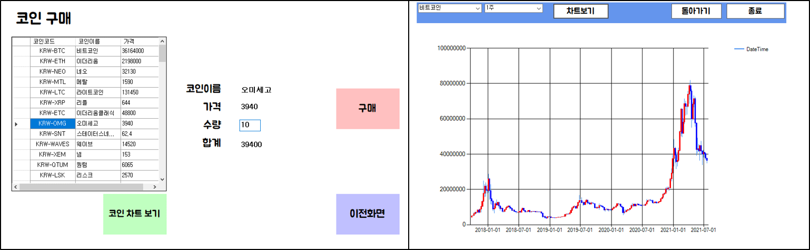

# <C# 프로젝트>
이 저장소는 C# WinForm 코인데이터, 환율데이터를 사용한 ATM기 프로젝트를 저장한 곳입니다.
- C#는 Visual Studio 2019에서 사용한 환경에서 진행하였습니다.
- DataBase는 MySQL를 사용한 환경에서 진행하였습니다.   

## 제작기간
2021/06/22 ~ 2021/07/12


## 소개
- C#
    - 기본 폼과 폼 위에 패널 구현
        - 송금 : 송금 전 상대방 계좌 확인, 송금 후 본인 은행계좌 잔액 갱신, 거래내역 갱신 구현
        - 조회 : 본인 정보를 입력, 본인 소유의 모든 계좌 조회 구현
        - 외화 : 당일 환율정보 api를 불러옴, 불러온 api를 기준을 환전기능 구현, 환전 후 해외계좌 잔액, 은행계좌 잔액 갱신 구현
        - 가상화폐 : 가상화폐 거래소 Upbit api를 불러옴, 단위 시간당 새로고침 되는 데이터 차트 구현, 가상화폐 구매 구현, 구매 후 본인 가상화폐 계좌 갱신, 은행계좌 잔액 갱신 구현
- MySQL
    - MySQL Workbench를 활용하여 DB 관리
        - account : 현금 보유량을 알 수 있는 계좌 DB
        - coin : 가상화폐 보유량을 알 수 있는 DB
        - exchange : 외화 보유량을 알 수 있는 DB
        - transaction : 거래 내역이 기록되는 DB
    - 트리거를 활용하여 transaction 내에 기록되는 거래내역을 기반으로 자동으로 account의 잔액 업데이트

## 기능 상세소개
- 송금(무통장입금, 계좌이체 버튼)
    
    : insert 쿼리문을 활용하여 거래내역을 저장하는 DB에 데이터 입력
    
    
    
    ```C#
    public void transaction(string out_acc, string out_bank, string out_name, double out_balance,
            string in_acc, string in_bank, string in_name, double in_balance, double trans_amount)
        {
            string sql = "Insert Into transaction (trans_date," +
                "out_acc,out_bank,out_name,out_balance," +
                "in_acc,in_bank,in_name,in_balance," +
                "trans_price,trans_type)" +
                //출금계좌 잔액에서 송금금액 빼서 송금했을 당시 금액 저장
                "value(now(), '" + out_acc + "', '" + out_bank + "', '" + out_name + "'," + (out_balance - trans_amount) + "," +
                //입금계좌 잔액에서 입금금액 더해서 입금했을 당시 금액 저장
                "'" + in_acc + "', '" + in_bank + "', '" + in_name + "'," + (in_balance + trans_amount) + "," + trans_amount + ", 'money'); ";
            using (MySqlConnection conn = new MySqlConnection(connStr))
            {
                MySqlCommand cmd = new MySqlCommand(sql, conn);
                conn.Open();
                cmd.CommandText = sql;
                cmd.ExecuteNonQuery();
            }
        }
    ```

- 조회(거래내역 조회, 내 계좌 조회 버튼)
    
    : select 쿼리문을 활용하여 로그인한 계좌의 거래내역 및 이름, 전화번호가 동일한 타행 계좌 조회
    
    
    
                          <거래내역 조회>                                                   <내 계좌 조회>
                          
    - 거래내역 조회 CODE

  ```C#
  public List<TsHistory> TsHistory(string acc_num, string bank)
        {
            // 거래내역 받을 리스트 생성
            List<TsHistory> list = new List<TsHistory>();
            // 거래내역을 담을 클래스
            TsHistory th;
            using (MySqlConnection conn = new MySqlConnection(connStr))
            {
                conn.Open();
                //거래 내역에서 입금,출금 내역 조회후 날짜순으로 정렬
                string sql = $"select * from ("
                               + $" SELECT trans_date as trans_date, out_name as name , trans_price as price , in_balance as balance, '입금' as type"
                               + $" FROM atm.transaction where in_acc = '{acc_num}' and in_bank = '{bank}' Union"
                               + $" SELECT trans_date as trans_date, in_name as name, trans_price as price , out_balance as balance, '출금' as type"
                               + $" FROM atm.transaction where out_acc = '{acc_num}' and out_bank = '{bank}') a"
                               + $" order by trans_date desc; ";
                //ExecuteReader를 이용하여 연결 모드로 데이타 가져오기
                MySqlCommand cmd = new MySqlCommand(sql, conn);
                MySqlDataReader rdr = cmd.ExecuteReader();
                while (rdr.Read())
                {
                    //거래내역을 담을 클래스 생성
                    th = new TsHistory();
                    th.trans_date = rdr["trans_date"].ToString();
                    th.name = rdr["name"].ToString();
                    th.balance = double.Parse(rdr["balance"].ToString());
                    th.type = rdr["type"].ToString();

                    //입금액, 출금액 앞에 +,- 표시
                    if(th.type == "입금")
                    {
                        th.amount = "+" + rdr["price"].ToString();
                    }
                    else
                    {
                        th.amount = "-" + rdr["price"].ToString();
                    }
                    //거래내역 리스트에 추가
                    list.Add(th);
                }
                rdr.Close();
            }
            //거래내역 리스트 리턴
            return list;
        }
  ```
    - 내 계좌 조회 CODE

  ```C#
    private void button_check_Click(object sender, EventArgs e)
        {
            string connStr = "Server=192.168.0.104;Database=atm;Uid=root;Pwd=1234;";
            using (MySqlConnection conn = new MySqlConnection(connStr))
            {
                conn.Open();
                //textBox_name.Text 와 textBox_num.Text 는 로그인한 계좌주의 이름과 전화번호
                string sql = "SELECT acc_num, bank, name, balance FROM account WHERE name= '" 
                + textBox_name.Text + "' and phone= '" + textBox_num.Text + "';";
                MySqlCommand cmd = new MySqlCommand(sql, conn);
                MySqlDataReader rdr = cmd.ExecuteReader();
                MySQL_Manager.accounts.Clear();
                
                while (rdr.Read())
                {
                    string bank = rdr["bank"].ToString();
                    string acc_num = rdr["acc_num"].ToString();
                    string name = rdr["name"].ToString();
                    double balance = double.Parse(rdr["balance"].ToString());
                    Account temp = new Account(bank, acc_num, name, balance);
                    MySQL_Manager.accounts.Add(temp);
                }
                rdr.Close();
                
                dataGridView1.DataSource = null;
                dataGridView1.DataSource = MySQL_Manager.accounts;
            }
        }
  ```
    
- 외화(외화거래 버튼)

    : API를 활용하여 특정 날짜의 환율 정보를 불러오고 이를 활용하여 거래를 진행

    

                        <환율정보 조회 및 거래>                                              <보유 외화 조회>
    - API를 통해 환율 정보를 불러오는 코드
    
  ```C#
    //한국수출입은행으로부터 특정 날짜(해당 코드는 당일)의 환율 정보를 불러오는 API 활용
    public void CurrentExchangeRate()
        {
            using (WebClient wc = new WebClient())
            {
                wc.Encoding = System.Text.Encoding.UTF8; 
                var json = wc.DownloadString("https://www.koreaexim.go.kr/site/program/financial/exchangeJSON?authkey=" + 
                mykey + "&searchdate=" + DateTime.Now.ToString("yyyyMMdd") + "&data=AP01");
                var objs = JArray.Parse(json).ToObject<List<JObject>>();
                string price = "";
                string name = "";
                string country = "";
                dataGridView1.DataSource = null;
                exchanges.Clear();
                // 화폐명, 화폐코드, 환율 정보를 list에 추가
                for (int i = 0; i < objs.Count; i++)
                {
                    country = objs[i]["cur_nm"].ToString().Trim().Replace(",", "");
                    name = objs[i]["cur_unit"].ToString().Trim().Replace(",", "");
                    price = objs[i]["kftc_deal_bas_r"].ToString().Trim().Replace(",", "");
                    ExchangeRate temp = new ExchangeRate(country, name, price);
                    exchanges.Add(temp);
                }
                dataGridView1.DataSource = exchanges;
            }
        }
  ``` 
    - DB를 통해 잔액 확인 후 외화를 거래하는 코드
  ```C#
    public void exchange(double result)
        {
            string connStr = "Server=192.168.0.104;Database=atm;Uid=root;Pwd=1234;";
            using (MySqlConnection conn = new MySqlConnection(connStr))
            {
                conn.Open();
                string sql2 = "insert transaction(trans_date, in_acc, in_bank, in_name, out_acc, out_bank, out_name, out_balance, trans_price, trans_type) " +
                    "values (now(), '00000', '외환거래소', '외환거래소', '" + parentForm.getUserAccount() + "','" + parentForm.getBank() + "','" + parentForm.getName() 
                    + "'," + result +"," + Convert.ToDouble(label_totalPrice.Text) + ",'exchange')";
                MySqlCommand cmd = new MySqlCommand(sql2, conn);
                MySqlDataReader rdr = cmd.ExecuteReader();
                rdr.Close();
                //이미 보유하고 있는 외화인지를 확인
                string sql = "SELECT count(*) as cnt FROM exchange where acc_num = '" + parentForm.getUserAccount() + "' and country = '" + label_country.Text + "'; ";
                cmd = new MySqlCommand(sql, conn);
                rdr = cmd.ExecuteReader();
                rdr.Read();
                int count = Convert.ToInt32(rdr["cnt"]);
                //이미 보유하고 있는 외화인 경우 update, 첫 거래인 외화의 경우 insert를 통해 외화 보유 내역 
                if (count == 0)
                {
                    sql = "INSERT INTO exchange(acc_num,country,currency,amount) VALUES( '" + parentForm.getUserAccount() + "','" + label_country.Text 
                    + "','" + label_currency.Text + "'," + textBox_amount.Text + "); ";
                }
                else
                {
                    sql = "update exchange set amount = amount+" + textBox_amount.Text + " where acc_num = '" + parentForm.getUserAccount() 
                    + "' and currency = '" + label_currency.Text + "';";
                }
                rdr.Close();
                cmd = new MySqlCommand(sql, conn);
                rdr = cmd.ExecuteReader();
                rdr.Close();
            }
        }
  ```
- 가상화폐

    : Upbit를 통해 실시간으로 가상화폐 가격을 조회, 해당 가격 변동을 그래프로 표시하고 거래
    
     
        
    - Upbit로부터 가상화폐 가격 정보 조회 CODE
    ```C#
            void coins()
            {
                using (WebClient wc = new WebClient())
                {
                    wc.Encoding = System.Text.Encoding.UTF8;
                    var json1 = wc.DownloadString("https://api.upbit.com/v1/market/all");
                    var objs1 = JArray.Parse(json1).ToObject<List<JObject>>();
                    string market = "";
                    string korean_name = "";
                    string trade_price = "";

                    cprice.Clear();

                    for (int i = 0; i < objs1.Count; i++)
                    {
                        if (objs1[i]["market"].ToString().Substring(0, 3) == "KRW")
                        {
                            korean_name += objs1[i]["korean_name"].ToString().Trim().Replace(",", "") + ",";
                            market += objs1[i]["market"].ToString().Trim().Replace(",", "") + ",";
                        }
                     }
                    korean_name = korean_name.Substring(0, korean_name.Length - 1);
                    market = market.Substring(0, market.Length - 1);
                    var json2 = wc.DownloadString("https://api.upbit.com/v1/ticker?markets=" + market);
                    var objs2 = JArray.Parse(json2).ToObject<List<JObject>>();
                    trade_price = objs2[0]["trade_price"].ToString().Trim().Replace(",", "");

                    for (int i = 1; i < objs2.Count; i++)
                    {
                        trade_price += "," + objs2[i]["trade_price"].ToString().Trim().Replace(",", "");
                    }
                    string[] temp1 = korean_name.Split(',');
                    string[] temp2 = market.Split(',');
                    string[] temp3 = trade_price.Split(',');
                    for (int i = 0; i < temp1.Length; i++)
                    {
                        cprice.Add(new CPrice(temp2[i], temp1[i], temp3[i]));
                    }
                }
                dataGridView1.DataSource = cprice;
                dataGridView1.Refresh();
            }
    ```
    - 가상화폐 가격 변화를 그래프로 표시하는 CODE
    ```C#
    private async void CurrentCoin()
        {
            string requestUrl;
            int intCheck;
            string coin = comboBox1.SelectedValue.ToString();
            string time = comboBox2.SelectedValue.ToString();

            if (int.TryParse(time, out intCheck))
                requestUrl = $"https://crix-api-endpoint.upbit.com/v1/crix/candles/minutes/{time}?code=CRIX.UPBIT.KRW-{coin}&count=200";
            else
                requestUrl = $"https://crix-api-endpoint.upbit.com/v1/crix/candles/{time}?code=CRIX.UPBIT.KRW-{coin}&count=200";
            using (var client = new HttpClient())
            {
                try
                {
                    var response = await client.GetAsync(requestUrl);
                    var responseString = await response.Content.ReadAsStringAsync();
                    var json = JArray.Parse(responseString);

                    DataTable dt = JsonConvert.DeserializeObject<DataTable>(json.ToString());

                    chart1.Series["DateTime"].XValueMember = "candleDateTimeKst";
                    chart1.Series["DateTime"].YValueMembers = "highPrice,lowPrice,openingPrice,tradePrice";
                    chart1.Series["DateTime"].XValueType = System.Windows.Forms.DataVisualization.Charting.ChartValueType.DateTime;
                    chart1.Series["DateTime"].CustomProperties = "PriceDownColor=Blue, PriceUpColor=Red";
                    chart1.Series["DateTime"]["OpenCloseStyle"] = "Triangle";
                    chart1.Series["DateTime"]["ShowOpenClose"] = "Both";
                    chart1.DataManipulator.IsStartFromFirst = true;
                    chart1.DataSource = dt;
                    chart1.DataBind();
                }
                catch
                {
                    MessageBox.Show("다른 코인 선택");
                }
            }
        }
    ```    

    
    
    - 가상화폐를 통한 수익률 계산
    
    ```C#
    private void countEarningRate()
        {
            data = ucp_clist.getCprice();
            if (data != null && data.DataSource != null)
            {
                cp = data.DataSource as List<CPrice>;
                ClientInvest = 0;
                ClientRevenue = 0;
                for (int i = 0; i < coins.Count; i++)
                {
                    CPrice mycoin = cp.Find(x => x.korean_name == coins[i].coin_name);
                    if (mycoin != null)
                    {
                        coins[i].nowPrice = Convert.ToDouble(mycoin.trade_price);
                        coins[i].revenue = coins[i].total_amount * (coins[i].nowPrice-coins[i].AvgPrice);
                        coins[i].earning_rate =(-1* (Math.Truncate((((coins[i].AvgPrice / Convert.ToDouble(mycoin.trade_price)) * 100) - 100) * 1000) / 1000)) + "%";
                    }
                    ClientInvest += (coins[i].AvgPrice * coins[i].total_amount);
                    ClientRevenue += (coins[i].revenue);
                }
                label_invest.Text = "" + ClientInvest.ToString("#,#");
                label_revenue.Text = "" + ClientRevenue.ToString();
                double revenue = Convert.ToDouble(label_revenue.Text);
                if (revenue > 0)
                {
                    label_revenue.ForeColor = Color.Red;
                }
                else
                {
                    label_revenue.ForeColor = Color.Blue;
                }
            }
        }
    ```
        
        

    
